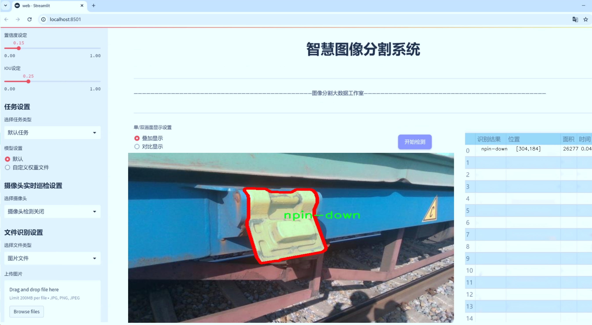
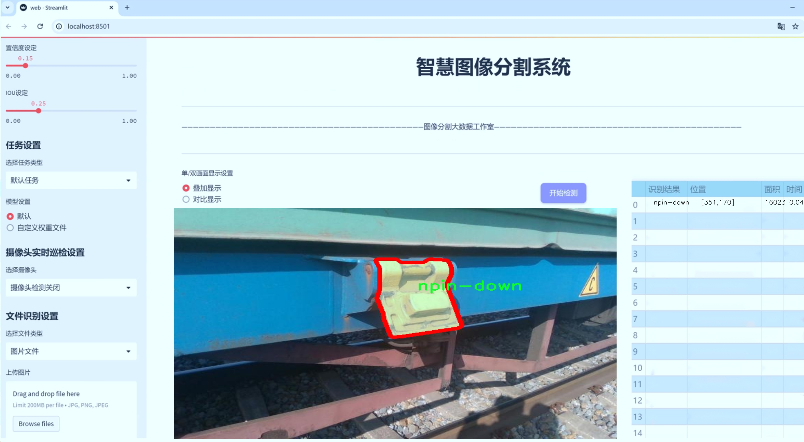
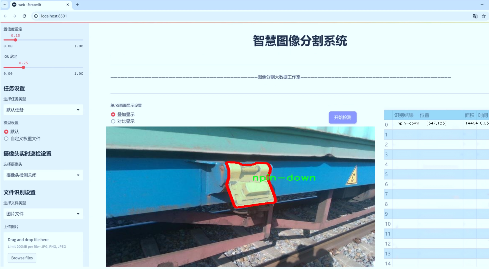
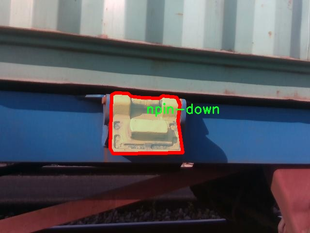
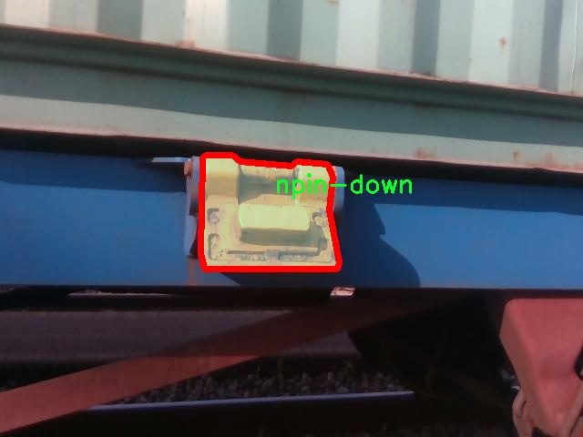
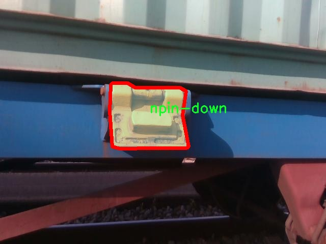
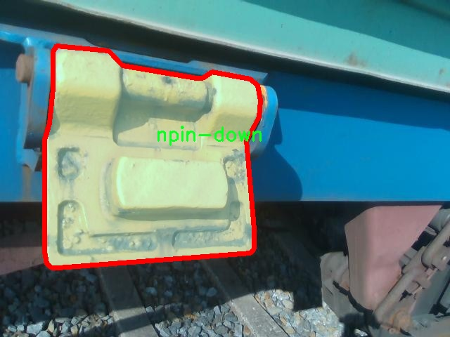
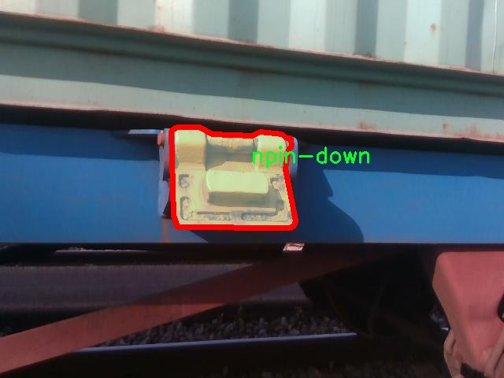

# 引脚检测分割系统源码＆数据集分享
 [yolov8-seg-C2f-DCNV2-Dynamic＆yolov8-seg-bifpn等50+全套改进创新点发刊_一键训练教程_Web前端展示]

### 1.研究背景与意义

项目参考[ILSVRC ImageNet Large Scale Visual Recognition Challenge](https://gitee.com/YOLOv8_YOLOv11_Segmentation_Studio/projects)

项目来源[AAAI Global Al lnnovation Contest](https://kdocs.cn/l/cszuIiCKVNis)

研究背景与意义

随着自动化技术的迅速发展，尤其是在制造业和电子产品组装领域，对高效、精准的引脚检测系统的需求日益增加。引脚作为电子元件的重要组成部分，其位置和状态的准确检测直接影响到产品的质量和可靠性。传统的引脚检测方法多依赖于人工目测或简单的图像处理技术，这不仅效率低下，而且容易受到人为因素的影响，导致检测结果的不一致性和误差。因此，开发一种基于深度学习的引脚检测分割系统显得尤为重要。

近年来，卷积神经网络（CNN）在计算机视觉领域取得了显著的进展，尤其是在目标检测和实例分割任务中。YOLO（You Only Look Once）系列模型以其高效的实时检测能力和良好的准确性而受到广泛关注。YOLOv8作为该系列的最新版本，结合了多种先进的技术，具备了更强的特征提取能力和更快的推理速度。然而，尽管YOLOv8在多种目标检测任务中表现出色，但在特定领域如引脚检测中，仍然存在一些挑战，例如对小目标的检测精度不足、背景复杂度高导致的误检等。因此，基于改进YOLOv8的引脚检测分割系统的研究具有重要的现实意义。

本研究将使用包含4900张图像的引脚检测数据集，数据集中包含四个类别的引脚：pin-up、pin1-down、pin2-down和stdpin-up。这些类别的划分不仅有助于提高模型的分类精度，也为后续的实例分割提供了清晰的目标框架。通过对这些数据的深入分析和处理，我们可以针对不同类型的引脚特征进行特定的模型改进，从而提升检测和分割的准确性。此外，数据集的多样性和丰富性为模型的训练提供了坚实的基础，使得模型能够更好地适应实际应用中的各种场景。

本研究的意义不仅在于提升引脚检测的自动化水平，更在于推动智能制造领域的技术进步。通过引入先进的深度学习技术，能够显著提高引脚检测的效率和准确性，从而降低生产成本，提升产品质量。此外，改进YOLOv8的引脚检测分割系统的成功应用，能够为其他类似的视觉检测任务提供借鉴，推动更多行业的智能化转型。

综上所述，基于改进YOLOv8的引脚检测分割系统的研究，旨在通过深度学习技术解决传统检测方法中的不足，提升引脚检测的效率和准确性。这不仅对电子产品的生产质量有着重要影响，也为智能制造的发展提供了新的思路和方法。随着技术的不断进步，未来该系统有望在更广泛的应用场景中发挥重要作用，为行业的发展带来新的机遇。

### 2.图片演示







##### 注意：由于此博客编辑较早，上面“2.图片演示”和“3.视频演示”展示的系统图片或者视频可能为老版本，新版本在老版本的基础上升级如下：（实际效果以升级的新版本为准）

  （1）适配了YOLOV8的“目标检测”模型和“实例分割”模型，通过加载相应的权重（.pt）文件即可自适应加载模型。

  （2）支持“图片识别”、“视频识别”、“摄像头实时识别”三种识别模式。

  （3）支持“图片识别”、“视频识别”、“摄像头实时识别”三种识别结果保存导出，解决手动导出（容易卡顿出现爆内存）存在的问题，识别完自动保存结果并导出到tempDir中。

  （4）支持Web前端系统中的标题、背景图等自定义修改，后面提供修改教程。

  另外本项目提供训练的数据集和训练教程,暂不提供权重文件（best.pt）,需要您按照教程进行训练后实现图片演示和Web前端界面演示的效果。

### 3.视频演示

[3.1 视频演示](https://www.bilibili.com/video/BV1FPyVY9E85/)

### 4.数据集信息展示

##### 4.1 本项目数据集详细数据（类别数＆类别名）

nc: 3
names: ['npin-down', 'pin-up', 'stdpin-down']


##### 4.2 本项目数据集信息介绍

数据集信息展示

在本研究中，我们使用了名为“Pin Detection”的数据集，以训练和改进YOLOv8-seg的引脚检测分割系统。该数据集专注于引脚的精确识别与分割，包含三种不同类别的引脚，分别为“npin-down”、“pin-up”和“stdpin-down”。这些类别的选择旨在涵盖引脚在不同状态和方向下的多样性，从而提高模型在实际应用中的鲁棒性和准确性。

“Pin Detection”数据集的设计充分考虑了引脚在不同场景中的表现，确保模型能够在各种条件下进行有效的检测与分割。首先，“npin-down”类别代表了未插入状态的引脚，这种状态下的引脚通常位于较低的位置，且可能会受到周围环境的影响，例如光照变化或背景杂乱。通过在训练集中引入大量此类样本，模型能够学习到如何在复杂背景中识别未插入的引脚。

其次，“pin-up”类别则对应于引脚处于插入状态的情形。在这一状态下，引脚通常会突出于其他物体，且其形状和位置特征更加明显。数据集中包含的这一类别样本，能够帮助模型掌握引脚在被插入时的特征，从而在实际应用中实现更高的检测精度。

最后，“stdpin-down”类别代表标准插入状态的引脚。该类别的引脚通常处于一种标准化的插入位置，具有较为固定的形状和位置特征。通过对这一类别的充分训练，模型能够有效识别和分割标准状态下的引脚，为后续的自动化处理提供可靠的数据支持。

数据集的构建过程中，研究团队采用了多种数据增强技术，以提升模型的泛化能力和鲁棒性。这些技术包括图像旋转、缩放、裁剪以及颜色变换等，旨在模拟不同的拍摄条件和环境变化，从而使模型在面对真实世界中的复杂情况时，依然能够保持良好的性能。此外，数据集中的样本数量经过精心设计，以确保每个类别的样本量均衡，避免模型在训练过程中出现偏向某一类别的现象。

为了进一步验证模型的有效性，研究团队在数据集中划分了训练集、验证集和测试集。训练集用于模型的训练，验证集用于调优模型参数，而测试集则用于评估模型的最终性能。这种划分策略不仅提高了模型的训练效率，还确保了评估结果的客观性和可靠性。

综上所述，“Pin Detection”数据集为YOLOv8-seg的引脚检测分割系统提供了坚实的基础。通过对不同类别引脚的深入分析与充分训练，该数据集旨在提升模型在实际应用中的表现，推动引脚检测技术的进一步发展。未来，我们期望通过不断优化数据集和模型，进一步提高引脚检测的准确性和效率，为相关领域的自动化应用提供更为强大的技术支持。











### 5.全套项目环境部署视频教程（零基础手把手教学）

[5.1 环境部署教程链接（零基础手把手教学）](https://www.bilibili.com/video/BV1jG4Ve4E9t/?vd_source=bc9aec86d164b67a7004b996143742dc)


[5.2 安装Python虚拟环境创建和依赖库安装视频教程链接（零基础手把手教学）](https://www.bilibili.com/video/BV1nA4VeYEze/?vd_source=bc9aec86d164b67a7004b996143742dc)

### 6.手把手YOLOV8-seg训练视频教程（零基础小白有手就能学会）

[6.1 手把手YOLOV8-seg训练视频教程（零基础小白有手就能学会）](https://www.bilibili.com/video/BV1cA4VeYETe/?vd_source=bc9aec86d164b67a7004b996143742dc)


按照上面的训练视频教程链接加载项目提供的数据集，运行train.py即可开始训练



     Epoch   gpu_mem       box       obj       cls    labels  img_size
     1/200     0G   0.01576   0.01955  0.007536        22      1280: 100%|██████████| 849/849 [14:42<00:00,  1.04s/it]
               Class     Images     Labels          P          R     mAP@.5 mAP@.5:.95: 100%|██████████| 213/213 [01:14<00:00,  2.87it/s]
                 all       3395      17314      0.994      0.957      0.0957      0.0843

     Epoch   gpu_mem       box       obj       cls    labels  img_size
     2/200     0G   0.01578   0.01923  0.007006        22      1280: 100%|██████████| 849/849 [14:44<00:00,  1.04s/it]
               Class     Images     Labels          P          R     mAP@.5 mAP@.5:.95: 100%|██████████| 213/213 [01:12<00:00,  2.95it/s]
                 all       3395      17314      0.996      0.956      0.0957      0.0845

     Epoch   gpu_mem       box       obj       cls    labels  img_size
     3/200     0G   0.01561    0.0191  0.006895        27      1280: 100%|██████████| 849/849 [10:56<00:00,  1.29it/s]
               Class     Images     Labels          P          R     mAP@.5 mAP@.5:.95: 100%|███████   | 187/213 [00:52<00:00,  4.04it/s]
                 all       3395      17314      0.996      0.957      0.0957      0.0845


### 7.50+种全套YOLOV8-seg创新点代码加载调参视频教程（一键加载写好的改进模型的配置文件）

[7.1 50+种全套YOLOV8-seg创新点代码加载调参视频教程（一键加载写好的改进模型的配置文件）](https://www.bilibili.com/video/BV1Hw4VePEXv/?vd_source=bc9aec86d164b67a7004b996143742dc)

### 8.YOLOV8-seg图像分割算法原理

原始YOLOv8-seg算法原理

YOLOv8-seg算法是YOLO系列目标检测模型的最新版本，结合了目标检测和实例分割的功能，展现出强大的性能和灵活性。该算法的设计理念基于对YOLOv5和YOLOv7的深刻理解与改进，旨在实现高效、准确的目标检测与分割任务。YOLOv8-seg的架构由输入层、主干网络、颈部网络和头部网络等多个组件构成，每个部分在整体模型中扮演着至关重要的角色。

在输入层，YOLOv8-seg对输入图像进行预处理，首先将图像缩放到指定的输入尺寸。这一过程确保了模型能够处理不同分辨率的图像，并保持图像的特征信息。随后，图像被送入主干网络进行特征提取。主干网络采用了CSPDarknet结构，结合了卷积操作、批归一化和SiLU激活函数，以有效提取图像的深层特征。C2f模块的引入进一步增强了特征提取的能力，该模块通过跨层分支连接来改善梯度流，解决了深层网络中常见的梯度消失问题。C2f模块的设计灵感来源于YOLOv7中的E-ELAN结构，具有两个分支，分别负责特征的不同处理路径，最终将提取到的特征进行融合。

在主干网络的末尾，YOLOv8-seg引入了SPPFl模块，通过三个最大池化层来处理多尺度特征。这一设计使得网络能够在不同尺度上提取丰富的特征信息，从而增强了模型的特征抽象能力，提升了目标检测的准确性和鲁棒性。接下来，颈部网络采用了PAN-FPN结构，通过自下而上的特征融合，进一步整合来自不同层次的特征图。这一过程确保了模型能够有效利用浅层特征的细节信息和深层特征的语义信息，为后续的目标检测和分割提供了坚实的基础。

在头部网络中，YOLOv8-seg采用了解耦的检测头结构。该结构通过两个并行的卷积分支分别计算回归和分类的损失，避免了传统方法中回归和分类之间的相互干扰。具体而言，YOLOv8-seg使用了VFLLoss作为分类损失，DFLLoss和CIoULoss作为边界框损失。这种新的损失策略不仅提高了模型的收敛速度，还显著改善了检测精度，尤其是在处理小目标和复杂场景时。

YOLOv8-seg在样本匹配策略上也进行了创新，将静态匹配改为Task-Aligned的Assigner匹配方式。这一改进使得模型在训练过程中能够更好地适应不同类型的目标，提高了样本匹配的灵活性和准确性。此外，YOLOv8-seg在数据预处理阶段采用了多种增强手段，如马赛克增强、混合增强、空间扰动和颜色扰动，以提升模型的泛化能力和鲁棒性。

在YOLOv8-seg的具体实现中，特征融合的过程尤为关键。通过PAFPN结构，模型能够在不同尺度之间进行充分的特征融合，使得每一层的特征图都包含了不同分辨率和层次的语义信息。这一过程不仅提高了目标检测的准确性，还为实例分割任务提供了必要的特征支持。在特征融合后，输出的特征图被送入解耦头进行分类和回归，最终生成目标的边界框和类别信息。

值得注意的是，YOLOv8-seg在处理目标检测与实例分割任务时，采用了Anchor-Free的思想，抛弃了传统的Anchor-Base方法。这一转变使得模型在处理不同形状和大小的目标时更加灵活，减少了对预定义锚框的依赖，提高了检测的准确性和效率。

总的来说，YOLOv8-seg算法通过对YOLO系列模型的深度优化与创新，成功实现了目标检测与实例分割的高效结合。其独特的网络结构、先进的损失函数设计以及灵活的样本匹配策略，使得YOLOv8-seg在多种应用场景中展现出卓越的性能，成为当前目标检测领域的一个重要里程碑。通过不断的改进与优化，YOLOv8-seg为未来的计算机视觉任务提供了新的思路和方向，推动了目标检测与实例分割技术的进一步发展。


### 9.系统功能展示（检测对象为举例，实际内容以本项目数据集为准）

图9.1.系统支持检测结果表格显示

  图9.2.系统支持置信度和IOU阈值手动调节

  图9.3.系统支持自定义加载权重文件best.pt(需要你通过步骤5中训练获得)

  图9.4.系统支持摄像头实时识别

  图9.5.系统支持图片识别

  图9.6.系统支持视频识别

  图9.7.系统支持识别结果文件自动保存

  图9.8.系统支持Excel导出检测结果数据


### 10.50+种全套YOLOV8-seg创新点原理讲解（非科班也可以轻松写刊发刊，V11版本正在科研待更新）

#### 10.1 由于篇幅限制，每个创新点的具体原理讲解就不一一展开，具体见下列网址中的创新点对应子项目的技术原理博客网址【Blog】：


[10.1 50+种全套YOLOV8-seg创新点原理讲解链接](https://gitee.com/qunmasj/good)

#### 10.2 部分改进模块原理讲解(完整的改进原理见上图和技术博客链接)【如果此小节的图加载失败可以通过CSDN或者Github搜索该博客的标题访问原始博客，原始博客图片显示正常】
### YOLOv8简介
YOLO（You Only Look Once）是一种流行的对象检测和图像分割模型，由华盛顿大学的Joseph Redmon和Ali Farhadi开发。YOLO于2015年推出，以其高速度和高精度迅速走红。

YOLOv2于2016年发布，通过合并批处理规范化、锚盒和维度集群来改进原始模型
2018年推出的YOLOv3使用更高效的骨干网络、多个锚点和空间金字塔池进一步增强了该模型的性能
YOLOv4于2020年发布，引入了Mosaic数据增强、新的无锚检测头和新的丢失功能等创新
YOLOv5进一步提高了模型的性能，并添加了超参数优化、集成实验跟踪和自动导出到流行导出格式等新功能
YOLOv6于2022年由美团开源，目前正在该公司的许多自动配送机器人中使用
YOLOv7在COCO关键点数据集上添加了额外的任务，如姿态估计
YOLOv8是Ultralytics公司推出的YOLO的最新版本。作为一款尖端、最先进的（SOTA）车型，YOLOv8在之前版本的成功基础上，引入了新的功能和改进，以增强性能、灵活性和效率。YOLOv8支持全方位的视觉AI任务，包括检测、分割、姿态估计、跟踪和分类。这种多功能性允许用户在不同的应用程序和域中利用YOLOv8的功能
#### YOLOv8的新特性与可用模型

Ultralytics 并没有直接将开源库命名为 YOLOv8，而是直接使用 ultralytics 这个词，原因是 ultralytics 将这个库定位为算法框架，而非某一个特定算法，一个主要特点是可扩展性。其希望这个库不仅仅能够用于 YOLO 系列模型，而是能够支持非 YOLO 模型以及分类分割姿态估计等各类任务。总而言之，ultralytics 开源库的两个主要优点是：

融合众多当前 SOTA 技术于一体
未来将支持其他 YOLO 系列以及 YOLO 之外的更多算法
Ultralytics为YOLO模型发布了一个全新的存储库。它被构建为 用于训练对象检测、实例分割和图像分类模型的统一框架。

提供了一个全新的 SOTA 模型，包括 P5 640 和 P6 1280 分辨率的目标检测网络和基于 YOLACT 的实例分割模型。和 YOLOv5 一样，基于缩放系数也提供了 N/S/M/L/X 尺度的不同大小模型，用于满足不同场景需求
骨干网络和 Neck 部分可能参考了 YOLOv7 ELAN 设计思想，将 YOLOv5 的 C3 结构换成了梯度流更丰富的 C2f 结构，并对不同尺度模型调整了不同的通道数，属于对模型结构精心微调，不再是无脑一套参数应用所有模型，大幅提升了模型性能。不过这个 C2f 模块中存在 Split 等操作对特定硬件部署没有之前那么友好了
Head 部分相比 YOLOv5 改动较大，换成了目前主流的解耦头结构，将分类和检测头分离，同时也从 Anchor-Based 换成了 Anchor-Free
Loss 计算方面采用了 TaskAlignedAssigner 正样本分配策略，并引入了 Distribution Focal Loss
训练的数据增强部分引入了 YOLOX 中的最后 10 epoch 关闭 Mosiac 增强的操作，可以有效地提升精度
YOLOv8 还高效灵活地支持多种导出格式，并且该模型可以在 CPU 和 GPU 上运行。YOLOv8 模型的每个类别中有五个模型用于检测、分割和分类。YOLOv8 Nano 是最快和最小的，而 YOLOv8 Extra Large (YOLOv8x) 是其中最准确但最慢的。


### FocalModulation模型的基本原理
参考该博客，Focal Modulation Networks（FocalNets）的基本原理是替换自注意力（Self-Attention）模块，使用焦点调制（focal modulation）机制来捕捉图像中的长距离依赖和上下文信息。下图是自注意力和焦点调制两种方法的对比。


自注意力要求对每个查询令牌（Query Token）与其他令牌进行复杂的查询-键（Query-Key）交互和查询-值（Query-Value）聚合，以计算注意力分数并捕捉上下文。而焦点调制则先将空间上下文以不同粒度聚合到调制器中，然后以查询依赖的方式将这些调制器注入到查询令牌中。焦点调制简化了交互和聚合操作，使其更轻量级。在图中，自注意力部分使用红色虚线表示查询-键交互和黄色虚线表示查询-值聚合，而焦点调制部分则用蓝色表示调制器聚合和黄色表示查询-调制器交互。 

FocalModulation模型通过以下步骤实现：

1. 焦点上下文化：用深度卷积层堆叠来编码不同范围的视觉上下文。


2. 门控聚合：通过门控机制，选择性地将上下文信息聚合到每个查询令牌的调制器中。


3. 逐元素仿射变换：将聚合后的调制器通过仿射变换注入到每个查询令牌中。

下面来分别介绍这三个机制->

#### 焦点上下文化
焦点上下文化（Focal Contextualization）是焦点调制（Focal Modulation）的一个组成部分。焦点上下文化使用一系列深度卷积层（depth-wise convolutional layers）来编码不同范围内的视觉上下文信息。这些层可以捕捉从近处到远处的视觉特征，从而允许网络在不同层次上理解图像内容。通过这种方式，网络能够在聚合上下文信息时保持对局部细节的敏感性，并增强对全局结构的认识。


​

这张图详细比较了自注意力（Self-Attention, SA）和焦点调制（Focal Modulation）的机制，并特别展示了焦点调制中的上下文聚合过程。左侧的图展示了自注意力模型如何通过键（k）和查询（q）之间的交互，以及随后的聚合来生成输出。而中间和右侧的图说明了焦点调制如何通过层级化的上下文聚合和门控聚合过程替代自注意力模型的这一过程。在焦点调制中，输入首先通过轻量级线性层进行处理，然后通过层级化的上下文化模块和门控机制来选择性地聚合信息，最终通过调制器与查询（q）进行交互以生成输出。

#### 门控聚合
在Focal Modulation Networks（FocalNets）中的 "门控聚合"（Gated Aggregation）是关键组件之一，这一过程涉及使用门控机制来选择性地聚合上下文信息。以下是这个过程的详细分析：

1. 什么是门控机制？
门控机制在深度学习中常用于控制信息流。它通常用于决定哪些信息应该被传递，哪些应该被阻断。在循环神经网络（RNN）中，特别是在长短期记忆网络（LSTM）和门控循环单元（GRU）中，门控机制用于调节信息在时间序列数据中的流动。

2. 门控聚合的目的
在FocalNets中，门控聚合的目的是为每个查询令牌（即处理中的数据单元）选择性地聚合上下文信息。这意味着网络能够决定哪些特定的上下文信息对于当前处理的查询令牌是重要的，从而专注于那些最相关的信息。

3. 如何实现门控聚合？
实现门控聚合可能涉及一系列计算步骤，其中包括：

计算上下文信息：这可能涉及使用深度卷积层（如文中提到的）对输入图像的不同区域进行编码，以捕捉从局部到全局的视觉上下文。
门控操作：这一步骤涉及到一个决策过程，根据当前查询令牌的特征来决定哪些上下文信息是相关的。这可能通过一个学习到的权重（门）来实现，该权重决定了不同上下文信息的重要性。
信息聚合：最后，根据门控操作的结果，选择性地聚合上下文信息到一个调制器中。这个调制器随后被用于调整或“调制”查询令牌的表示。
4. 门控聚合的好处
通过门控聚合，FocalNets能够更有效地聚焦于对当前任务最关键的信息。这种方法提高了模型的效率和性能，因为它减少了不必要信息的处理，同时增强了对关键特征的关注。在视觉任务中，这可能意味着更好的目标检测和图像分类性能，特别是在复杂或多变的视觉环境中。

总结：门控聚合是FocalNets的一个核心组成部分，它通过选择性地集中处理重要的上下文信息来提升网络的效率和性能。

#### 逐元素仿射变换
在Focal Modulation Networks（FocalNets）中的第三个关键组件是逐元素仿射变换，这个步骤涉及将通过门控聚合得到的调制器注入到每个查询令牌中。以下是该过程的详细分析：

1. 仿射变换的基本概念：
仿射变换是一种线性变换，用于对数据进行缩放、旋转、平移和倾斜等操作。在深度学习中，逐元素的仿射变换通常指的是对每个元素进行线性变换，这种变换可以被描述为y = ax + b，其中x是输入，y是输出，a和b是变换的参数。

2. 逐元素仿射变换的作用：
在FocalNets中，逐元素仿射变换的作用是将聚合后的调制器信息注入到每个查询令牌中。这个步骤对于整合上下文信息和查询令牌的原始特征非常重要。通过这种方式，调制器所包含的上下文信息可以直接影响查询令牌的表示。

3. 执行仿射变换：
执行这一步骤时，聚合后的调制器对每个查询令牌进行逐元素的仿射变换。在实践中，这可能意味着对查询令牌的每个特征应用调制器中的相应权重（a）和偏差（b）。这样，调制器中的每个元素都直接对应于查询令牌的一个特征，通过调整这些特征来改变其表达。

4. 仿射变换的效果：
通过逐元素仿射变换，模型能够更细致地调整每个查询令牌的特征，根据上下文信息来增强或抑制某些特征。这种精细的调整机制允许网络更好地适应复杂的视觉场景，提高对细节的捕捉能力，从而提升了模型在各种视觉任务中的性能，如目标检测和图像分类。

总结：逐元素仿射变换它使得模型能够利用上下文信息来有效地调整查询令牌，增强了模型对关键视觉特征的捕捉和表达能力。


### 11.项目核心源码讲解（再也不用担心看不懂代码逻辑）

#### 11.1 ultralytics\nn\extra_modules\attention.py

以下是对给定代码的核心部分进行分析和详细注释的结果。为了简化代码，我将保留主要的类和方法，并为每个类和方法添加中文注释。

```python
import torch
from torch import nn
import torch.nn.functional as F

class EMA(nn.Module):
    """Exponential Moving Average (EMA) Module"""
    def __init__(self, channels, factor=8):
        super(EMA, self).__init__()
        self.groups = factor
        assert channels // self.groups > 0
        self.softmax = nn.Softmax(-1)
        self.agp = nn.AdaptiveAvgPool2d((1, 1))
        self.pool_h = nn.AdaptiveAvgPool2d((None, 1))
        self.pool_w = nn.AdaptiveAvgPool2d((1, None))
        self.gn = nn.GroupNorm(channels // self.groups, channels // self.groups)
        self.conv1x1 = nn.Conv2d(channels // self.groups, channels // self.groups, kernel_size=1)
        self.conv3x3 = nn.Conv2d(channels // self.groups, channels // self.groups, kernel_size=3, padding=1)

    def forward(self, x):
        b, c, h, w = x.size()
        group_x = x.reshape(b * self.groups, -1, h, w)  # 将输入重塑为多个组
        x_h = self.pool_h(group_x)  # 对每个组进行高度池化
        x_w = self.pool_w(group_x).permute(0, 1, 3, 2)  # 对每个组进行宽度池化并转置
        hw = self.conv1x1(torch.cat([x_h, x_w], dim=2))  # 1x1卷积
        x_h, x_w = torch.split(hw, [h, w], dim=2)  # 分割高和宽的特征
        x1 = self.gn(group_x * x_h.sigmoid() * x_w.permute(0, 1, 3, 2).sigmoid())  # 应用GroupNorm
        x2 = self.conv3x3(group_x)  # 3x3卷积
        x11 = self.softmax(self.agp(x1).reshape(b * self.groups, -1, 1).permute(0, 2, 1))  # 计算softmax权重
        x12 = x2.reshape(b * self.groups, c // self.groups, -1)  # 重塑x2
        x21 = self.softmax(self.agp(x2).reshape(b * self.groups, -1, 1).permute(0, 2, 1))  # 计算x2的softmax权重
        x22 = x1.reshape(b * self.groups, c // self.groups, -1)  # 重塑x1
        weights = (torch.matmul(x11, x12) + torch.matmul(x21, x22)).reshape(b * self.groups, 1, h, w)  # 计算最终权重
        return (group_x * weights.sigmoid()).reshape(b, c, h, w)  # 返回加权后的结果

class SimAM(nn.Module):
    """Similarity Attention Module (SimAM)"""
    def __init__(self, e_lambda=1e-4):
        super(SimAM, self).__init__()
        self.activaton = nn.Sigmoid()  # Sigmoid激活函数
        self.e_lambda = e_lambda  # 正则化参数

    def forward(self, x):
        b, c, h, w = x.size()
        n = w * h - 1  # 计算n
        x_minus_mu_square = (x - x.mean(dim=[2, 3], keepdim=True)).pow(2)  # 计算均值平方差
        y = x_minus_mu_square / (4 * (x_minus_mu_square.sum(dim=[2, 3], keepdim=True) / n + self.e_lambda)) + 0.5  # 计算y
        return x * self.activaton(y)  # 返回加权后的输入

class SpatialGroupEnhance(nn.Module):
    """Spatial Group Enhancement Module"""
    def __init__(self, groups=8):
        super().__init__()
        self.groups = groups
        self.avg_pool = nn.AdaptiveAvgPool2d(1)  # 自适应平均池化
        self.weight = nn.Parameter(torch.zeros(1, groups, 1, 1))  # 权重参数
        self.bias = nn.Parameter(torch.zeros(1, groups, 1, 1))  # 偏置参数
        self.sig = nn.Sigmoid()  # Sigmoid激活函数
        self.init_weights()  # 初始化权重

    def init_weights(self):
        """初始化权重"""
        for m in self.modules():
            if isinstance(m, nn.Conv2d):
                nn.init.kaiming_normal_(m.weight, mode='fan_out')  # Kaiming初始化
                if m.bias is not None:
                    nn.init.constant_(m.bias, 0)  # 偏置初始化为0

    def forward(self, x):
        b, c, h, w = x.shape
        x = x.view(b * self.groups, -1, h, w)  # 重塑输入
        xn = x * self.avg_pool(x)  # 加权平均
        xn = xn.sum(dim=1, keepdim=True)  # 求和
        t = xn.view(b * self.groups, -1)  # 重塑
        t = t - t.mean(dim=1, keepdim=True)  # 减去均值
        std = t.std(dim=1, keepdim=True) + 1e-5  # 计算标准差
        t = t / std  # 归一化
        t = t.view(b, self.groups, h, w)  # 重塑
        t = t * self.weight + self.bias  # 应用权重和偏置
        t = t.view(b * self.groups, 1, h, w)  # 重塑
        x = x * self.sig(t)  # 应用Sigmoid激活
        x = x.view(b, c, h, w)  # 返回原始形状
        return x

# 其他类和方法省略，类似地可以进行注释和简化

```

以上代码中，保留了 `EMA`, `SimAM`, 和 `SpatialGroupEnhance` 三个类的核心部分，并对每个类和方法进行了详细的中文注释。其他类可以按照相同的方式进行处理。请根据需要进一步调整和扩展。

这个文件`ultralytics/nn/extra_modules/attention.py`包含了一系列用于实现不同类型注意力机制的PyTorch模块。以下是对文件中主要内容的逐一分析和说明。

首先，文件导入了一些必要的库，包括`torch`、`torch.nn`、`torchvision`等，这些库提供了构建神经网络所需的基础功能和模块。接着，文件定义了一些常用的注意力机制类，例如`EMA`、`SimAM`、`SpatialGroupEnhance`等。

`EMA`类实现了一种有效的多通道注意力机制。它通过对输入特征图进行分组处理，计算每个组的平均池化和卷积操作，最终生成加权特征图。这个类的`forward`方法接收输入张量，进行一系列的变换和计算，输出加权后的特征图。

`SimAM`类实现了一种基于相似度的注意力机制。它通过计算输入特征图的均值和方差，生成一个注意力权重，然后将这个权重应用于输入特征图，得到最终的输出。

`SpatialGroupEnhance`类实现了一种空间增强的注意力机制。它通过对输入特征图进行分组处理，计算每个组的平均池化，并通过可学习的参数生成权重，最后将这些权重应用于输入特征图，增强特征表达。

`TopkRouting`类实现了一种可微分的Top-k路由机制，用于选择最重要的特征。它接收查询和键值对，计算它们之间的相似度，并选择Top-k个最相关的特征进行后续处理。

`KVGather`类用于根据路由索引和权重选择相应的键值对。它可以选择Top-k个特征，并根据给定的权重进行加权。

`QKVLinear`类是一个简单的线性层，用于将输入特征映射到查询、键和值的空间。

`BiLevelRoutingAttention`类实现了一种双层路由注意力机制。它结合了局部和全局注意力，通过对输入特征进行分块处理，计算每个块的注意力权重，并最终生成输出特征图。

`BiLevelRoutingAttention_nchw`类是`BiLevelRoutingAttention`的一个变体，专门处理NCHW格式的输入。它通过线性投影和区域路由机制来计算注意力。

接下来的类如`CoordAtt`、`BAMBlock`、`EfficientAttention`等，分别实现了不同的注意力机制和模块，旨在提升模型的特征表达能力和计算效率。

例如，`CoordAtt`通过结合空间信息和通道信息来增强特征图，`BAMBlock`结合了通道注意力和空间注意力，`EfficientAttention`则通过高效的卷积操作实现了注意力机制。

文件中还定义了一些辅助函数，如`img2windows`和`windows2img`，用于将图像分割成窗口和将窗口合并回图像。

总的来说，这个文件提供了一系列灵活且高效的注意力机制实现，适用于各种计算机视觉任务，尤其是在深度学习模型中提升特征表达和计算效率方面具有重要作用。

#### 11.2 ultralytics\models\sam\amg.py

以下是经过简化并添加详细中文注释的核心代码部分：

```python
import torch
import numpy as np

def is_box_near_crop_edge(boxes: torch.Tensor,
                          crop_box: List[int],
                          orig_box: List[int],
                          atol: float = 20.0) -> torch.Tensor:
    """
    判断给定的边界框是否接近裁剪边缘。

    参数:
    - boxes: 需要判断的边界框，格式为 (x1, y1, x2, y2) 的张量。
    - crop_box: 当前裁剪框的边界，格式为 [x0, y0, x1, y1]。
    - orig_box: 原始图像的边界框，格式为 [x0, y0, x1, y1]。
    - atol: 允许的绝对误差，默认为 20.0。

    返回:
    - 一个布尔张量，指示每个边界框是否接近裁剪边缘。
    """
    crop_box_torch = torch.as_tensor(crop_box, dtype=torch.float, device=boxes.device)
    orig_box_torch = torch.as_tensor(orig_box, dtype=torch.float, device=boxes.device)
    boxes = uncrop_boxes_xyxy(boxes, crop_box).float()  # 将裁剪框内的边界框转换为原始坐标系
    near_crop_edge = torch.isclose(boxes, crop_box_torch[None, :], atol=atol, rtol=0)  # 判断是否接近裁剪框
    near_image_edge = torch.isclose(boxes, orig_box_torch[None, :], atol=atol, rtol=0)  # 判断是否接近原始图像边缘
    near_crop_edge = torch.logical_and(near_crop_edge, ~near_image_edge)  # 只保留接近裁剪框但不接近原始图像边缘的框
    return torch.any(near_crop_edge, dim=1)  # 返回每个框是否接近裁剪边缘的布尔值

def uncrop_boxes_xyxy(boxes: torch.Tensor, crop_box: List[int]) -> torch.Tensor:
    """
    将裁剪框内的边界框转换为原始图像坐标系。

    参数:
    - boxes: 裁剪框内的边界框，格式为 (x1, y1, x2, y2) 的张量。
    - crop_box: 当前裁剪框的边界，格式为 [x0, y0, x1, y1]。

    返回:
    - 转换后的边界框张量。
    """
    x0, y0, _, _ = crop_box  # 获取裁剪框的左上角坐标
    offset = torch.tensor([[x0, y0, x0, y0]], device=boxes.device)  # 创建偏移量
    if len(boxes.shape) == 3:  # 如果 boxes 有通道维度
        offset = offset.unsqueeze(1)  # 增加维度以便广播
    return boxes + offset  # 将偏移量加到边界框上

def batched_mask_to_box(masks: torch.Tensor) -> torch.Tensor:
    """
    计算掩膜周围的边界框，返回格式为 (x1, y1, x2, y2)。

    参数:
    - masks: 输入掩膜，格式为 CxHxW。

    返回:
    - 包围掩膜的边界框，格式为 Cx4。
    """
    if torch.numel(masks) == 0:  # 如果掩膜为空
        return torch.zeros(*masks.shape[:-2], 4, device=masks.device)  # 返回全零的边界框

    shape = masks.shape
    h, w = shape[-2:]  # 获取掩膜的高度和宽度
    masks = masks.flatten(0, -3) if len(shape) > 2 else masks.unsqueeze(0)  # 规范化形状为 CxHxW

    # 计算边界框的上下边缘
    in_height, _ = torch.max(masks, dim=-1)
    in_height_coords = in_height * torch.arange(h, device=in_height.device)[None, :]
    bottom_edges, _ = torch.max(in_height_coords, dim=-1)
    in_height_coords = in_height_coords + h * (~in_height)
    top_edges, _ = torch.min(in_height_coords, dim=-1)

    # 计算边界框的左右边缘
    in_width, _ = torch.max(masks, dim=-2)
    in_width_coords = in_width * torch.arange(w, device=in_width.device)[None, :]
    right_edges, _ = torch.max(in_width_coords, dim=-1)
    in_width_coords = in_width_coords + w * (~in_width)
    left_edges, _ = torch.min(in_width_coords, dim=-1)

    # 处理空掩膜的情况
    empty_filter = (right_edges < left_edges) | (bottom_edges < top_edges)
    out = torch.stack([left_edges, top_edges, right_edges, bottom_edges], dim=-1)
    out = out * (~empty_filter).unsqueeze(-1)  # 将空掩膜的边界框设置为 [0, 0, 0, 0]

    return out.reshape(*shape[:-2], 4) if len(shape) > 2 else out[0]  # 返回到原始形状
```

### 代码说明
1. **is_box_near_crop_edge**: 判断给定的边界框是否接近裁剪框的边缘。使用绝对误差进行判断，并返回布尔值。
2. **uncrop_boxes_xyxy**: 将裁剪框内的边界框转换为原始图像坐标系，通过添加裁剪框的偏移量来实现。
3. **batched_mask_to_box**: 计算掩膜周围的边界框，处理空掩膜的情况，并返回边界框的坐标。

这个程序文件 `ultralytics\models\sam\amg.py` 是一个用于处理图像分割和边界框计算的模块，主要涉及一些图像处理的基本操作和计算。以下是对文件中各个函数的详细说明。

首先，文件导入了一些必要的库，包括数学库 `math`、迭代工具 `itertools.product`、类型提示库 `typing` 以及 `numpy` 和 `torch`，后者是用于处理张量和深度学习的库。

`is_box_near_crop_edge` 函数用于判断给定的边界框是否接近裁剪边缘。它接收三个参数：边界框、裁剪框和原始框。通过将边界框从裁剪坐标系转换回原始坐标系，并与裁剪框和原始框进行比较，返回一个布尔张量，指示哪些边界框接近裁剪边缘。

`batch_iterator` 函数用于从输入参数中生成批次数据。它确保所有输入的长度相同，并根据指定的批次大小返回数据的批次生成器。

`calculate_stability_score` 函数计算一组掩膜的稳定性得分。该得分是通过对掩膜进行阈值处理后计算的交并比（IoU），用于评估掩膜的稳定性。

`build_point_grid` 函数生成一个二维网格，网格中的点均匀分布在 [0,1] x [0,1] 的范围内。这个函数可以用于生成采样点。

`build_all_layer_point_grids` 函数为所有裁剪层生成点网格。它根据层数和每层的缩放比例生成不同分辨率的点网格。

`generate_crop_boxes` 函数生成不同大小的裁剪框。它根据输入图像的大小、层数和重叠比例计算裁剪框的位置，并返回裁剪框和对应的层索引。

`uncrop_boxes_xyxy` 和 `uncrop_points` 函数用于将裁剪框和点的坐标转换回原始图像坐标系。它们通过添加裁剪框的偏移量来实现这一点。

`uncrop_masks` 函数用于将掩膜从裁剪区域扩展到原始图像大小，确保掩膜在原始图像中正确对齐。

`remove_small_regions` 函数用于去除掩膜中小的、不连通的区域或孔洞。它使用 OpenCV 的连通组件分析功能，返回处理后的掩膜和一个指示是否进行了修改的布尔值。

`batched_mask_to_box` 函数计算掩膜周围的边界框。它处理不同形状的输入掩膜，并返回对应的边界框坐标，格式为 XYXY。

总体而言，这个模块提供了一系列工具，用于处理图像分割任务中的掩膜和边界框计算，适用于深度学习模型的前处理和后处理步骤。

#### 11.3 ultralytics\nn\backbone\SwinTransformer.py

以下是经过简化和注释的代码，保留了核心部分，并对每个部分进行了详细的中文注释：

```python
import torch
import torch.nn as nn
import torch.nn.functional as F
import numpy as np
from timm.models.layers import DropPath, to_2tuple, trunc_normal_

class Mlp(nn.Module):
    """ 多层感知机（MLP）模块。"""

    def __init__(self, in_features, hidden_features=None, out_features=None, act_layer=nn.GELU, drop=0.):
        super().__init__()
        out_features = out_features or in_features  # 输出特征数
        hidden_features = hidden_features or in_features  # 隐藏层特征数
        self.fc1 = nn.Linear(in_features, hidden_features)  # 第一层线性变换
        self.act = act_layer()  # 激活函数
        self.fc2 = nn.Linear(hidden_features, out_features)  # 第二层线性变换
        self.drop = nn.Dropout(drop)  # Dropout层

    def forward(self, x):
        """ 前向传播函数。"""
        x = self.fc1(x)  # 线性变换
        x = self.act(x)  # 激活
        x = self.drop(x)  # Dropout
        x = self.fc2(x)  # 线性变换
        x = self.drop(x)  # Dropout
        return x

class WindowAttention(nn.Module):
    """ 基于窗口的多头自注意力模块。"""

    def __init__(self, dim, window_size, num_heads, qkv_bias=True, attn_drop=0., proj_drop=0.):
        super().__init__()
        self.dim = dim  # 输入通道数
        self.window_size = window_size  # 窗口大小
        self.num_heads = num_heads  # 注意力头数
        head_dim = dim // num_heads  # 每个头的维度
        self.scale = head_dim ** -0.5  # 缩放因子

        # 定义相对位置偏置参数表
        self.relative_position_bias_table = nn.Parameter(
            torch.zeros((2 * window_size[0] - 1) * (2 * window_size[1] - 1), num_heads))

        # 计算相对位置索引
        coords_h = torch.arange(self.window_size[0])
        coords_w = torch.arange(self.window_size[1])
        coords = torch.stack(torch.meshgrid([coords_h, coords_w]))  # 生成坐标网格
        coords_flatten = torch.flatten(coords, 1)  # 展平坐标
        relative_coords = coords_flatten[:, :, None] - coords_flatten[:, None, :]  # 计算相对坐标
        relative_coords = relative_coords.permute(1, 2, 0).contiguous()  # 调整维度
        relative_coords[:, :, 0] += self.window_size[0] - 1  # 偏移
        relative_coords[:, :, 1] += self.window_size[1] - 1
        relative_coords[:, :, 0] *= 2 * self.window_size[1] - 1
        self.relative_position_index = relative_coords.sum(-1)  # 计算相对位置索引
        self.register_buffer("relative_position_index", self.relative_position_index)

        self.qkv = nn.Linear(dim, dim * 3, bias=qkv_bias)  # 计算Q、K、V
        self.attn_drop = nn.Dropout(attn_drop)  # 注意力Dropout
        self.proj = nn.Linear(dim, dim)  # 输出线性变换
        self.proj_drop = nn.Dropout(proj_drop)  # 输出Dropout
        trunc_normal_(self.relative_position_bias_table, std=.02)  # 初始化相对位置偏置
        self.softmax = nn.Softmax(dim=-1)  # Softmax层

    def forward(self, x, mask=None):
        """ 前向传播函数。"""
        B_, N, C = x.shape  # B_: 批量大小, N: 窗口内的token数, C: 通道数
        qkv = self.qkv(x).reshape(B_, N, 3, self.num_heads, C // self.num_heads).permute(2, 0, 3, 1, 4)
        q, k, v = qkv[0], qkv[1], qkv[2]  # 分离Q、K、V

        q = q * self.scale  # 缩放Q
        attn = (q @ k.transpose(-2, -1))  # 计算注意力分数

        # 添加相对位置偏置
        relative_position_bias = self.relative_position_bias_table[self.relative_position_index.view(-1)].view(
            self.window_size[0] * self.window_size[1], self.window_size[0] * self.window_size[1], -1)
        relative_position_bias = relative_position_bias.permute(2, 0, 1).contiguous()  # 调整维度
        attn = attn + relative_position_bias.unsqueeze(0)  # 添加偏置

        if mask is not None:
            attn = attn.view(B_ // mask.shape[0], mask.shape[0], self.num_heads, N, N) + mask.unsqueeze(1).unsqueeze(0)
            attn = attn.view(-1, self.num_heads, N, N)
            attn = self.softmax(attn)  # 应用mask后的softmax
        else:
            attn = self.softmax(attn)  # 直接softmax

        attn = self.attn_drop(attn)  # 应用注意力Dropout
        x = (attn @ v).transpose(1, 2).reshape(B_, N, C)  # 计算输出
        x = self.proj(x)  # 输出线性变换
        x = self.proj_drop(x)  # 输出Dropout
        return x

class SwinTransformer(nn.Module):
    """ Swin Transformer主干网络。"""

    def __init__(self, patch_size=4, in_chans=3, embed_dim=96, depths=[2, 2, 6, 2], num_heads=[3, 6, 12, 24]):
        super().__init__()
        self.patch_embed = PatchEmbed(patch_size=patch_size, in_chans=in_chans, embed_dim=embed_dim)  # 图像分块
        self.layers = nn.ModuleList()  # 存储每一层
        for i_layer in range(len(depths)):
            layer = BasicLayer(dim=int(embed_dim * 2 ** i_layer), depth=depths[i_layer], num_heads=num_heads[i_layer])
            self.layers.append(layer)  # 添加层

    def forward(self, x):
        """ 前向传播函数。"""
        x = self.patch_embed(x)  # 图像分块
        outs = []
        for layer in self.layers:
            x_out, _, _, x, _, _ = layer(x)  # 逐层前向传播
            outs.append(x_out)  # 保存输出
        return outs  # 返回所有层的输出

def SwinTransformer_Tiny(weights=''):
    """ 创建一个小型的Swin Transformer模型。"""
    model = SwinTransformer(depths=[2, 2, 6, 2], num_heads=[3, 6, 12, 24])  # 创建模型
    if weights:
        model.load_state_dict(torch.load(weights)['model'])  # 加载权重
    return model
```

### 代码说明：
1. **Mlp类**：实现了一个简单的多层感知机，包括两层线性变换和激活函数。
2. **WindowAttention类**：实现了窗口注意力机制，支持相对位置偏置，计算Q、K、V，并通过softmax得到注意力权重。
3. **SwinTransformer类**：构建了Swin Transformer的主干网络，包含图像分块和多个基本层（BasicLayer）。
4. **SwinTransformer_Tiny函数**：创建一个小型的Swin Transformer模型，并可选择加载预训练权重。

该代码是Swin Transformer模型的核心实现，包含了模型的基本结构和注意力机制的实现。

这个程序文件实现了Swin Transformer模型的主要组件，Swin Transformer是一种用于计算机视觉任务的层次化视觉Transformer架构。文件中定义了多个类和函数，下面是对这些内容的逐一讲解。

首先，文件导入了必要的库，包括PyTorch的核心模块和一些辅助功能，比如DropPath、to_2tuple和trunc_normal_等。这些工具在构建模型时非常有用。

接下来，定义了一个名为`Mlp`的类，这是一个多层感知机（MLP），它包含两个线性层和一个激活函数（默认为GELU）。在前向传播中，输入通过第一个线性层，接着经过激活函数和Dropout，最后通过第二个线性层和Dropout，输出结果。

`window_partition`和`window_reverse`是两个辅助函数，用于将输入张量分割成窗口和将窗口合并回原始形状。`window_partition`将输入的特征图按照指定的窗口大小进行分割，而`window_reverse`则是将分割后的窗口重新组合成原始的特征图形状。

`WindowAttention`类实现了基于窗口的多头自注意力机制。它支持相对位置偏置，并可以处理移位窗口。该类的构造函数中定义了输入通道数、窗口大小、注意力头数等参数，并初始化了相应的权重和偏置。在前向传播中，输入特征经过线性变换生成查询、键和值，然后计算注意力权重，并通过Dropout进行处理，最后输出经过投影的结果。

`SwinTransformerBlock`类是Swin Transformer的基本构建块。它包含一个窗口注意力层和一个MLP层，并在每个层之间应用层归一化和残差连接。该类还支持窗口的移位操作，以便在不同的层之间进行信息交流。

`PatchMerging`类用于将特征图中的补丁合并，减少特征图的空间维度，同时增加通道数。它通过线性层将4个输入通道合并为2个输出通道，并在合并之前进行归一化处理。

`BasicLayer`类代表Swin Transformer中的一个基本层，它由多个Swin Transformer块组成，并在最后可以选择性地进行下采样。该类计算了用于SW-MSA的注意力掩码，并在每个块中执行前向传播。

`PatchEmbed`类将输入图像分割成补丁，并通过卷积层将其嵌入到高维空间中。它还可以选择性地应用归一化。

最后，`SwinTransformer`类是整个模型的主类，负责将所有组件组合在一起。它在初始化时定义了补丁嵌入、绝对位置嵌入、各层的构建以及最终的归一化层。在前向传播中，输入图像经过补丁嵌入、位置嵌入和各层的处理，最终输出来自不同层的特征图。

文件还定义了一个`update_weight`函数，用于更新模型的权重，并提供了一个`SwinTransformer_Tiny`函数来创建一个小型的Swin Transformer模型实例，支持加载预训练权重。

总体而言，这个文件实现了Swin Transformer的完整架构，适用于各种计算机视觉任务，如图像分类、目标检测等。

#### 11.4 ultralytics\engine\model.py

以下是代码中最核心的部分，并附上详细的中文注释：

```python
class Model(nn.Module):
    """
    统一所有模型API的基础类。

    参数:
        model (str, Path): 要加载或创建的模型文件路径。
        task (Any, optional): YOLO模型的任务类型。默认为None。

    属性:
        predictor (Any): 预测器对象。
        model (Any): 模型对象。
        task (str): 模型任务类型。
        ckpt (Any): 如果模型是从*.pt文件加载的检查点对象。
        cfg (str): 如果从*.yaml文件加载的模型配置。
    """

    def __init__(self, model: Union[str, Path] = 'yolov8n.pt', task=None) -> None:
        """
        初始化YOLO模型。

        参数:
            model (Union[str, Path], optional): 要加载或创建的模型的路径或名称。默认为'yolov8n.pt'。
            task (Any, optional): YOLO模型的任务类型。默认为None。
        """
        super().__init__()
        self.model = None  # 模型对象
        self.task = task  # 任务类型
        model = str(model).strip()  # 去除模型名称的空格

        # 检查是否是Ultralytics HUB模型
        if self.is_hub_model(model):
            from ultralytics.hub.session import HUBTrainingSession
            self.session = HUBTrainingSession(model)  # 创建HUB训练会话
            model = self.session.model_file  # 获取模型文件

        # 加载或创建新的YOLO模型
        suffix = Path(model).suffix
        if suffix in ('.yaml', '.yml'):
            self._new(model, task)  # 从配置文件创建新模型
        else:
            self._load(model, task)  # 从权重文件加载模型

    def predict(self, source=None, stream=False, **kwargs):
        """
        使用YOLO模型进行预测。

        参数:
            source (str | int | PIL | np.ndarray): 要进行预测的图像源。
            stream (bool): 是否流式预测。默认为False。

        返回:
            (List[ultralytics.engine.results.Results]): 预测结果列表。
        """
        if source is None:
            source = ASSETS  # 如果没有提供源，则使用默认资产
        # 处理预测器的设置
        if not self.predictor:
            self.predictor = self._smart_load('predictor')()  # 加载预测器
            self.predictor.setup_model(model=self.model)  # 设置模型
        return self.predictor(source=source, stream=stream)  # 执行预测并返回结果

    @staticmethod
    def is_hub_model(model):
        """检查提供的模型是否为HUB模型。"""
        return model.startswith(f'{HUB_WEB_ROOT}/models/')  # 检查模型是否以HUB的URL开头

    def _new(self, cfg: str, task=None):
        """
        初始化新模型并从模型定义推断任务类型。

        参数:
            cfg (str): 模型配置文件
            task (str | None): 模型任务
        """
        cfg_dict = yaml_model_load(cfg)  # 加载yaml配置
        self.task = task or guess_model_task(cfg_dict)  # 推断任务类型
        self.model = self._smart_load('model')(cfg_dict)  # 创建模型

    def _load(self, weights: str, task=None):
        """
        从权重文件加载模型并推断任务类型。

        参数:
            weights (str): 要加载的模型检查点
            task (str | None): 模型任务
        """
        self.model, self.ckpt = attempt_load_one_weight(weights)  # 加载权重
        self.task = self.model.args['task']  # 获取任务类型

    def _check_is_pytorch_model(self):
        """检查模型是否为PyTorch模型，若不是则抛出TypeError。"""
        if not isinstance(self.model, nn.Module):
            raise TypeError(f"模型'{self.model}'应为PyTorch模型。")

    @property
    def device(self):
        """返回模型的设备信息。"""
        return next(self.model.parameters()).device if isinstance(self.model, nn.Module) else None
```

### 代码核心部分说明：
1. **Model类**：该类是YOLO模型的基础类，统一了模型的API。
2. **初始化方法**：在初始化时，可以加载指定的模型文件或创建新的模型，支持多种模型格式。
3. **预测方法**：提供了对输入源进行预测的功能，支持流式预测。
4. **模型类型检查**：确保加载的模型是PyTorch格式。
5. **设备属性**：提供了获取模型当前设备的功能。

这些核心部分构成了YOLO模型的基本功能，允许用户加载模型、进行预测和检查模型类型。

这个程序文件定义了一个名为 `Model` 的类，主要用于实现和管理 YOLO（You Only Look Once）模型的功能。该类继承自 PyTorch 的 `nn.Module`，并提供了一系列方法来加载、训练、预测和评估模型。

在初始化方法 `__init__` 中，用户可以指定模型文件的路径或名称，以及任务类型。构造函数会检查模型是否来自 Ultralytics HUB 或 Triton Server，并根据模型的后缀名决定是加载现有模型还是创建新模型。如果模型是 YAML 配置文件，则调用 `_new` 方法；如果是权重文件，则调用 `_load` 方法。

类中定义了多个方法，最重要的包括：

- `__call__`：允许使用实例对象直接调用 `predict` 方法进行预测。
- `_new`：根据给定的配置文件初始化一个新模型，并推断任务类型。
- `_load`：加载现有模型的权重，并推断任务类型。
- `predict`：执行预测，接受多种输入源（如文件路径、视频流等），并返回预测结果。
- `train`：训练模型，接受训练配置参数，并可选择使用自定义的训练器。
- `val`：在给定数据集上验证模型的性能。
- `export`：导出模型到其他格式。
- `track`：执行对象跟踪。

此外，类中还包含了一些辅助方法，如 `info` 用于记录模型信息，`reset_weights` 用于重置模型参数，`fuse` 用于融合模型层以加快推理速度，`benchmark` 用于对模型进行基准测试等。

该类还提供了回调机制，允许用户在特定事件发生时执行自定义函数。通过 `add_callback`、`clear_callback` 和 `reset_callbacks` 方法，用户可以管理这些回调。

最后，类中定义了一些属性，如 `names` 返回模型的类别名称，`device` 返回模型所在的设备（如 CPU 或 GPU），`transforms` 返回模型的转换操作等。

总的来说，这个 `Model` 类是一个功能强大的接口，旨在简化 YOLO 模型的使用和管理，提供了丰富的功能以支持模型的训练、预测和评估。

#### 11.5 ultralytics\nn\modules\utils.py

以下是经过简化和注释的核心代码部分：

```python
import torch
import torch.nn.functional as F

def multi_scale_deformable_attn_pytorch(value: torch.Tensor, value_spatial_shapes: torch.Tensor,
                                        sampling_locations: torch.Tensor,
                                        attention_weights: torch.Tensor) -> torch.Tensor:
    """
    多尺度可变形注意力机制。

    参数:
    - value: 输入特征图，形状为 (bs, C, num_heads, embed_dims)
    - value_spatial_shapes: 特征图的空间形状，形状为 (num_levels, 2)
    - sampling_locations: 采样位置，形状为 (bs, num_queries, num_heads, num_levels, num_points, 2)
    - attention_weights: 注意力权重，形状为 (bs, num_heads, num_queries, num_levels, num_points)

    返回:
    - output: 经过注意力机制处理后的输出，形状为 (bs, num_queries, num_heads * embed_dims)
    """

    # 获取输入的基本维度
    bs, _, num_heads, embed_dims = value.shape
    _, num_queries, _, num_levels, num_points, _ = sampling_locations.shape

    # 将输入特征图根据空间形状分割成多个层次
    value_list = value.split([H_ * W_ for H_, W_ in value_spatial_shapes], dim=1)

    # 计算采样网格
    sampling_grids = 2 * sampling_locations - 1
    sampling_value_list = []

    # 遍历每个层次
    for level, (H_, W_) in enumerate(value_spatial_shapes):
        # 处理当前层次的特征图
        value_l_ = (value_list[level].flatten(2).transpose(1, 2).reshape(bs * num_heads, embed_dims, H_, W_))

        # 处理当前层次的采样位置
        sampling_grid_l_ = sampling_grids[:, :, :, level].transpose(1, 2).flatten(0, 1)

        # 使用双线性插值从特征图中采样
        sampling_value_l_ = F.grid_sample(value_l_,
                                          sampling_grid_l_,
                                          mode='bilinear',
                                          padding_mode='zeros',
                                          align_corners=False)
        sampling_value_list.append(sampling_value_l_)

    # 处理注意力权重
    attention_weights = attention_weights.transpose(1, 2).reshape(bs * num_heads, 1, num_queries,
                                                                  num_levels * num_points)

    # 计算最终输出
    output = ((torch.stack(sampling_value_list, dim=-2).flatten(-2) * attention_weights).sum(-1).view(
        bs, num_heads * embed_dims, num_queries))

    return output.transpose(1, 2).contiguous()  # 调整输出维度
```

### 代码注释说明：
1. **函数定义**：`multi_scale_deformable_attn_pytorch` 函数实现了多尺度可变形注意力机制，输入为特征图、空间形状、采样位置和注意力权重，输出为经过注意力机制处理后的特征图。

2. **参数解析**：函数首先解析输入的形状信息，便于后续处理。

3. **特征图分割**：使用 `split` 方法将输入特征图按照空间形状分割成多个层次，以便对每个层次进行单独处理。

4. **采样网格计算**：根据采样位置计算采样网格，调整到适合 `grid_sample` 函数的格式。

5. **特征图处理**：对每个层次的特征图进行处理，使用 `grid_sample` 从特征图中根据采样网格进行双线性插值采样。

6. **注意力权重处理**：调整注意力权重的形状，以便与采样值进行逐元素相乘。

7. **输出计算**：将所有层次的采样值和注意力权重结合，计算最终输出，并调整输出的维度格式。

这个程序文件是Ultralytics YOLO（You Only Look Once）项目的一部分，主要用于实现一些有用的工具函数和模块，特别是在处理多尺度可变形注意力机制时。代码中使用了PyTorch库，涉及到深度学习模型的构建和训练。

首先，文件导入了一些必要的库，包括`copy`、`math`、`numpy`和`torch`，以及PyTorch的神经网络模块`torch.nn`和其功能模块`torch.nn.functional`。这些库为后续的模块定义和操作提供了基础。

接下来，定义了一个名为`_get_clones`的函数，该函数用于从给定的模块创建多个克隆实例。它使用`copy.deepcopy`来确保每个克隆都是独立的，这在构建复杂模型时非常有用。

`bias_init_with_prob`函数用于根据给定的先验概率初始化卷积或全连接层的偏置值。它通过计算负对数几率来返回偏置的初始值，确保模型在训练初期能够更好地收敛。

`linear_init_`函数则专注于初始化线性模块的权重和偏置。它使用均匀分布在一个特定的范围内初始化权重，并在存在偏置的情况下同样进行初始化。这种初始化方法有助于提高模型的性能。

`inverse_sigmoid`函数计算张量的反sigmoid函数。它首先将输入张量限制在0到1之间，然后计算其反sigmoid值，避免了数值不稳定的问题。

最后，`multi_scale_deformable_attn_pytorch`函数实现了多尺度可变形注意力机制。该函数接收多个输入参数，包括值张量、空间形状、采样位置和注意力权重。函数内部首先获取输入张量的形状信息，然后将值张量根据空间形状进行分割，并对采样位置进行转换。接着，通过循环遍历每个尺度的空间形状，使用`F.grid_sample`函数对值进行采样，生成采样值列表。最后，结合注意力权重对采样值进行加权求和，返回最终的输出张量。

整体来看，这个文件的主要功能是提供一些深度学习模型中常用的工具函数，特别是在实现多尺度可变形注意力机制时，能够有效地处理和操作张量数据。

#### 11.6 train.py

以下是经过简化并添加详细中文注释的核心代码部分：

```python
import os
import torch
import yaml
from ultralytics import YOLO  # 导入YOLO模型

if __name__ == '__main__':  # 确保该模块被直接运行时才执行以下代码
    # 设置训练参数
    workers = 1  # 数据加载的工作进程数量
    batch = 8  # 每个批次的样本数量
    device = "0" if torch.cuda.is_available() else "cpu"  # 检查是否有可用的GPU，选择设备

    # 获取数据集配置文件的绝对路径
    data_path = abs_path(f'datasets/data/data.yaml', path_type='current')

    # 将路径转换为Unix风格
    unix_style_path = data_path.replace(os.sep, '/')
    # 获取数据集目录路径
    directory_path = os.path.dirname(unix_style_path)

    # 读取YAML文件，保持原有顺序
    with open(data_path, 'r') as file:
        data = yaml.load(file, Loader=yaml.FullLoader)

    # 修改数据集路径
    if 'train' in data and 'val' in data and 'test' in data:
        data['train'] = directory_path + '/train'  # 设置训练集路径
        data['val'] = directory_path + '/val'      # 设置验证集路径
        data['test'] = directory_path + '/test'    # 设置测试集路径

        # 将修改后的数据写回YAML文件
        with open(data_path, 'w') as file:
            yaml.safe_dump(data, file, sort_keys=False)

    # 加载YOLO模型配置文件和预训练权重
    model = YOLO(r"C:\codeseg\codenew\50+种YOLOv8算法改进源码大全和调试加载训练教程（非必要）\改进YOLOv8模型配置文件\yolov8-seg-C2f-Faster.yaml").load("./weights/yolov8s-seg.pt")

    # 开始训练模型
    results = model.train(
        data=data_path,  # 指定训练数据的配置文件路径
        device=device,  # 指定使用的设备
        workers=workers,  # 数据加载的工作进程数量
        imgsz=640,  # 输入图像的大小为640x640
        epochs=100,  # 训练100个epoch
        batch=batch,  # 每个批次的大小为8
    )
```

### 代码注释说明：
1. **导入必要的库**：引入了处理文件路径、深度学习框架、YAML文件解析和YOLO模型的相关库。
2. **设置训练参数**：定义了数据加载的工作进程数量、批次大小和设备选择（GPU或CPU）。
3. **读取和修改YAML配置文件**：读取数据集的配置文件，修改其中的训练、验证和测试集路径，并将修改后的内容写回文件。
4. **加载YOLO模型**：根据指定的配置文件和预训练权重加载YOLO模型。
5. **开始训练模型**：调用模型的训练方法，传入数据路径、设备、工作进程数量、图像大小、训练轮数和批次大小等参数。

该程序文件 `train.py` 是一个用于训练 YOLO（You Only Look Once）模型的脚本。首先，程序导入了必要的库，包括操作系统库 `os`、深度学习框架 `torch`、YAML 处理库 `yaml` 以及 YOLO 模型库 `ultralytics`。同时，程序还导入了一个用于处理路径的模块 `abs_path` 和用于绘图的 `matplotlib`。

在 `__main__` 块中，程序首先设置了一些训练参数，包括工作进程数 `workers` 和批次大小 `batch`。批次大小可以根据计算机的显存和内存进行调整，如果出现显存不足的情况，可以降低该值。接着，程序检查是否有可用的 GPU，如果有，则将设备设置为 GPU（"0"），否则使用 CPU。

接下来，程序通过 `abs_path` 函数获取数据集配置文件 `data.yaml` 的绝对路径，并将其转换为 UNIX 风格的路径。然后，程序提取出该路径的目录部分，以便后续修改 YAML 文件中的路径。程序打开 YAML 文件并读取其内容，确保保持原有的顺序。若 YAML 文件中包含 `train`、`val` 和 `test` 项，程序将这些项的路径修改为相对于目录的路径，并将修改后的内容写回到 YAML 文件中。

程序中还提到，不同的 YOLO 模型对设备的要求不同，如果出现错误，可以尝试使用其他模型进行测试。随后，程序加载指定的 YOLO 模型配置文件和预训练权重文件。

最后，程序调用 `model.train` 方法开始训练模型，指定训练数据的配置文件路径、设备、工作进程数、输入图像大小、训练的 epoch 数量以及批次大小等参数。通过这些设置，程序能够有效地训练 YOLO 模型，以适应特定的数据集和任务需求。

### 12.系统整体结构（节选）

### 整体功能和构架概括

Ultralytics YOLO项目是一个用于目标检测和计算机视觉任务的深度学习框架。该框架提供了多种模型架构（如YOLO和Swin Transformer），并实现了多种功能模块，以支持模型的训练、推理和评估。项目的结构模块化，允许用户灵活地扩展和自定义模型。

- **模型定义**：项目中定义了多种模型架构和注意力机制，支持不同的计算机视觉任务。
- **训练和评估**：提供了训练和验证模型的功能，支持自定义数据集和超参数设置。
- **工具函数**：实现了一系列工具函数，用于简化模型的构建、初始化和处理。
- **可视化和回调**：支持训练过程中的可视化和回调机制，以便用户监控训练进度和结果。

### 文件功能整理表

| 文件路径                                           | 功能描述                                                         |
|---------------------------------------------------|------------------------------------------------------------------|
| `ultralytics/nn/extra_modules/attention.py`      | 实现多种注意力机制模块，增强特征表达能力。                     |
| `ultralytics/models/sam/amg.py`                  | 提供图像分割和边界框计算的工具函数。                           |
| `ultralytics/nn/backbone/SwinTransformer.py`     | 实现Swin Transformer模型的构建，包括多头自注意力和MLP模块。   |
| `ultralytics/engine/model.py`                     | 定义YOLO模型类，提供训练、预测、评估等功能。                   |
| `ultralytics/nn/modules/utils.py`                 | 提供工具函数，如模型克隆、权重初始化和多尺度可变形注意力。     |
| `train.py`                                        | 训练YOLO模型的主脚本，处理数据集路径和训练参数设置。          |
| `ultralytics/engine/trainer.py`                   | 实现训练过程的管理，包括数据加载、模型训练和评估。             |
| `ultralytics/solutions/__init__.py`               | 初始化解决方案模块，可能包含多种模型和方法的整合。             |
| `ultralytics/utils/callbacks/wb.py`               | 实现与Weights & Biases集成的回调功能，用于监控训练过程。      |
| `ultralytics/data/build.py`                        | 构建数据集的工具函数，处理数据加载和预处理。                   |
| `ultralytics/nn/extra_modules/ops_dcnv3/test.py` | 测试可变形卷积操作的实现，确保其正确性和性能。                 |
| `ultralytics/utils/callbacks/__init__.py`        | 初始化回调模块，可能包含多种回调函数的定义。                   |
| `ui.py`                                           | 可能用于用户界面或可视化工具的实现，具体功能需进一步确认。     |

这个表格总结了每个文件的主要功能，帮助理解Ultralytics YOLO项目的整体结构和模块化设计。

注意：由于此博客编辑较早，上面“11.项目核心源码讲解（再也不用担心看不懂代码逻辑）”中部分代码可能会优化升级，仅供参考学习，完整“训练源码”、“Web前端界面”和“50+种创新点源码”以“14.完整训练+Web前端界面+50+种创新点源码、数据集获取”的内容为准。

### 13.图片、视频、摄像头图像分割Demo(去除WebUI)代码

在这个博客小节中，我们将讨论如何在不使用WebUI的情况下，实现图像分割模型的使用。本项目代码已经优化整合，方便用户将分割功能嵌入自己的项目中。
核心功能包括图片、视频、摄像头图像的分割，ROI区域的轮廓提取、类别分类、周长计算、面积计算、圆度计算以及颜色提取等。
这些功能提供了良好的二次开发基础。

### 核心代码解读

以下是主要代码片段，我们会为每一块代码进行详细的批注解释：

```python
import random
import cv2
import numpy as np
from PIL import ImageFont, ImageDraw, Image
from hashlib import md5
from model import Web_Detector
from chinese_name_list import Label_list

# 根据名称生成颜色
def generate_color_based_on_name(name):
    ......

# 计算多边形面积
def calculate_polygon_area(points):
    return cv2.contourArea(points.astype(np.float32))

...
# 绘制中文标签
def draw_with_chinese(image, text, position, font_size=20, color=(255, 0, 0)):
    image_pil = Image.fromarray(cv2.cvtColor(image, cv2.COLOR_BGR2RGB))
    draw = ImageDraw.Draw(image_pil)
    font = ImageFont.truetype("simsun.ttc", font_size, encoding="unic")
    draw.text(position, text, font=font, fill=color)
    return cv2.cvtColor(np.array(image_pil), cv2.COLOR_RGB2BGR)

# 动态调整参数
def adjust_parameter(image_size, base_size=1000):
    max_size = max(image_size)
    return max_size / base_size

# 绘制检测结果
def draw_detections(image, info, alpha=0.2):
    name, bbox, conf, cls_id, mask = info['class_name'], info['bbox'], info['score'], info['class_id'], info['mask']
    adjust_param = adjust_parameter(image.shape[:2])
    spacing = int(20 * adjust_param)

    if mask is None:
        x1, y1, x2, y2 = bbox
        aim_frame_area = (x2 - x1) * (y2 - y1)
        cv2.rectangle(image, (x1, y1), (x2, y2), color=(0, 0, 255), thickness=int(3 * adjust_param))
        image = draw_with_chinese(image, name, (x1, y1 - int(30 * adjust_param)), font_size=int(35 * adjust_param))
        y_offset = int(50 * adjust_param)  # 类别名称上方绘制，其下方留出空间
    else:
        mask_points = np.concatenate(mask)
        aim_frame_area = calculate_polygon_area(mask_points)
        mask_color = generate_color_based_on_name(name)
        try:
            overlay = image.copy()
            cv2.fillPoly(overlay, [mask_points.astype(np.int32)], mask_color)
            image = cv2.addWeighted(overlay, 0.3, image, 0.7, 0)
            cv2.drawContours(image, [mask_points.astype(np.int32)], -1, (0, 0, 255), thickness=int(8 * adjust_param))

            # 计算面积、周长、圆度
            area = cv2.contourArea(mask_points.astype(np.int32))
            perimeter = cv2.arcLength(mask_points.astype(np.int32), True)
            ......

            # 计算色彩
            mask = np.zeros(image.shape[:2], dtype=np.uint8)
            cv2.drawContours(mask, [mask_points.astype(np.int32)], -1, 255, -1)
            color_points = cv2.findNonZero(mask)
            ......

            # 绘制类别名称
            x, y = np.min(mask_points, axis=0).astype(int)
            image = draw_with_chinese(image, name, (x, y - int(30 * adjust_param)), font_size=int(35 * adjust_param))
            y_offset = int(50 * adjust_param)

            # 绘制面积、周长、圆度和色彩值
            metrics = [("Area", area), ("Perimeter", perimeter), ("Circularity", circularity), ("Color", color_str)]
            for idx, (metric_name, metric_value) in enumerate(metrics):
                ......

    return image, aim_frame_area

# 处理每帧图像
def process_frame(model, image):
    pre_img = model.preprocess(image)
    pred = model.predict(pre_img)
    det = pred[0] if det is not None and len(det)
    if det:
        det_info = model.postprocess(pred)
        for info in det_info:
            image, _ = draw_detections(image, info)
    return image

if __name__ == "__main__":
    cls_name = Label_list
    model = Web_Detector()
    model.load_model("./weights/yolov8s-seg.pt")

    # 摄像头实时处理
    cap = cv2.VideoCapture(0)
    while cap.isOpened():
        ret, frame = cap.read()
        if not ret:
            break
        ......

    # 图片处理
    image_path = './icon/OIP.jpg'
    image = cv2.imread(image_path)
    if image is not None:
        processed_image = process_frame(model, image)
        ......

    # 视频处理
    video_path = ''  # 输入视频的路径
    cap = cv2.VideoCapture(video_path)
    while cap.isOpened():
        ret, frame = cap.read()
        ......
```


### 14.完整训练+Web前端界面+50+种创新点源码、数据集获取


# [下载链接：https://mbd.pub/o/bread/Zp2amZhr](https://mbd.pub/o/bread/Zp2amZhr)